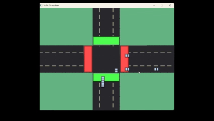

# Traffic Simulation

A real-time 2D simulation of a four-way intersection with traffic lights and vehicle dynamics.

## Features

- Four-way intersection with traffic lights
- Multiple vehicle types (cars, ambulances, police cars, fire trucks)
- Dynamic traffic light system that responds to congestion
- Realistic vehicle movement with turning behavior
- Priority system for emergency vehicles
- Visual enhancements for vehicles and road elements

## Dependencies

- SDL2 library
- C Standard Libraries (stdio.h, stdlib.h, math.h)

## Building and Running

```
gcc -o traffic_sim main.c traffic_simulation.c -lSDL2 -lm
./traffic_sim
```

